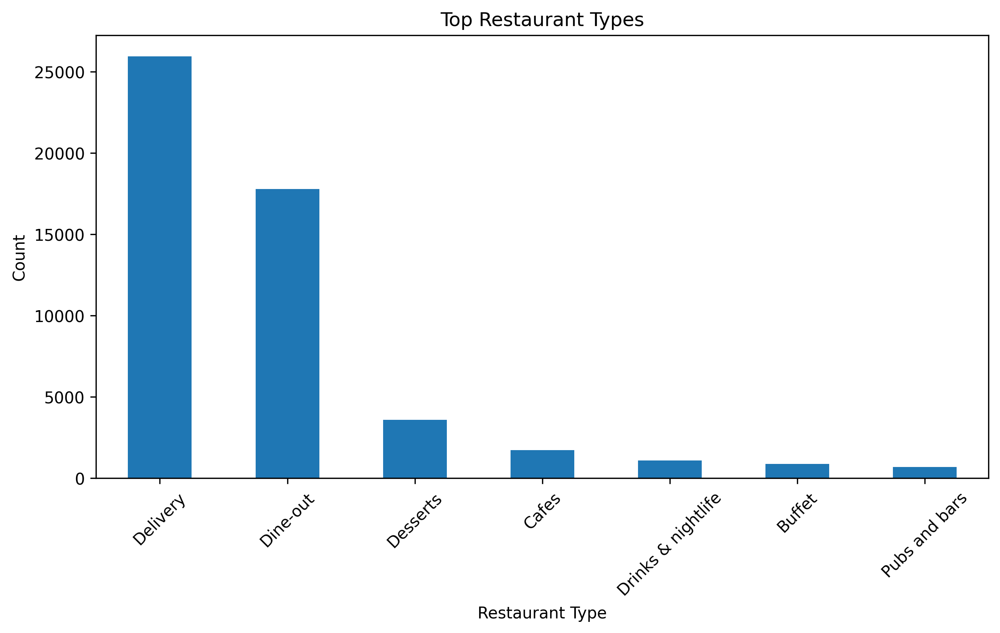

# 🍽️ Zomato Data Analysis

## 📌 Project Overview
This project analyzes restaurant data from Zomato using Python and data visualization techniques.

---

## 🛠️ Tools & Technologies Used
- Python
- Pandas
- Matplotlib
- Seaborn
- Jupyter Notebook
- Git & GitHub

---

## 📊 Analysis Performed
- Data Cleaning
- Missing Value Handling
- Restaurant Type Analysis
- Exploratory Data Analysis (EDA)

---

## 📸 Visualizations

### Top Restaurant Types

