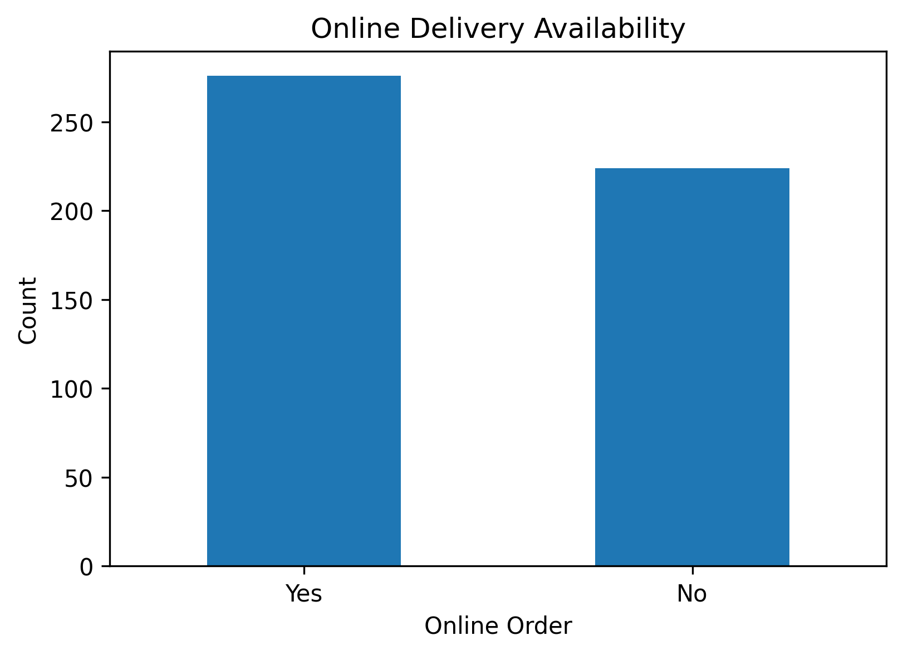
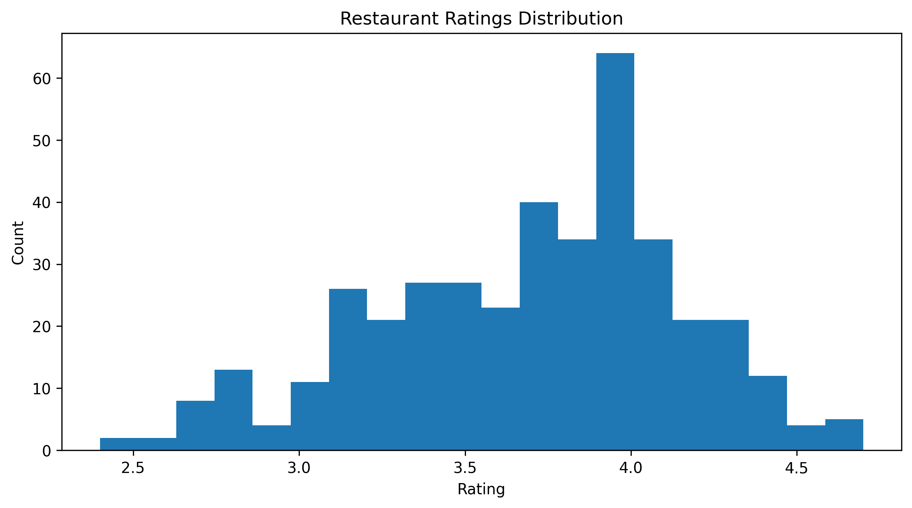
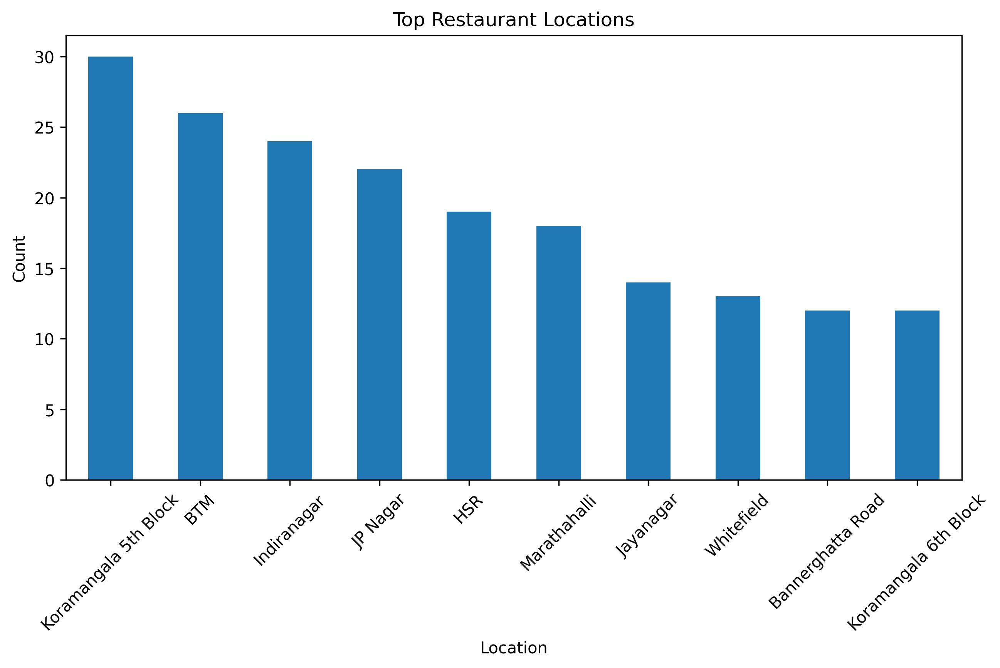
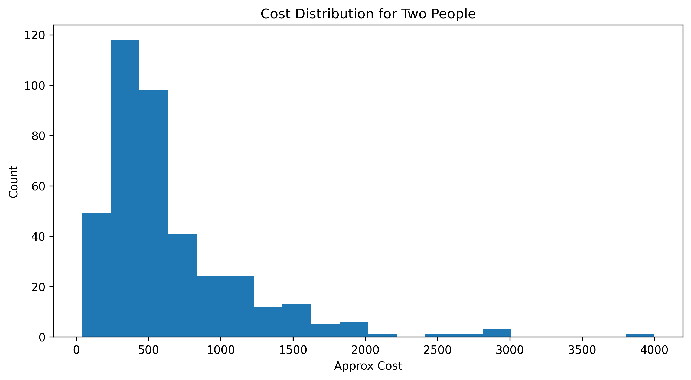
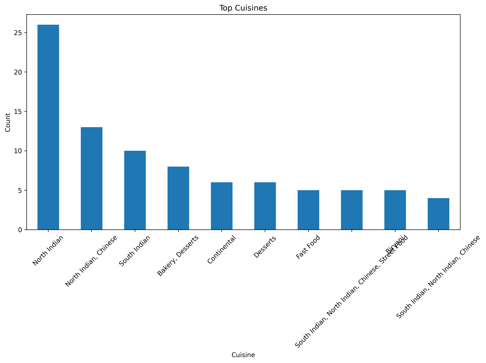
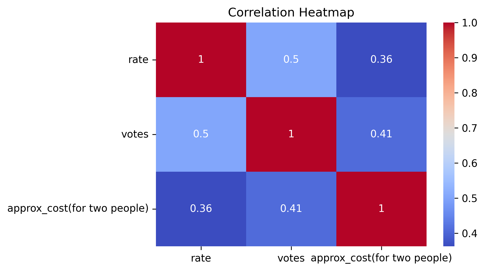

# 🍽️ Zomato Data Analysis

## 📌 Project Overview
This project analyzes restaurant data from Zomato using Python and data visualization techniques to discover insights related to restaurant types, ratings, cuisines, online delivery, pricing, and customer preferences.

---

## 🛠️ Tools & Technologies Used
- Python
- Pandas
- Matplotlib
- Seaborn
- Jupyter Notebook / Google Colab
- Git & GitHub

---

## 📂 Dataset Information
The dataset contains restaurant-related information such as:
- Restaurant Name
- Ratings
- Votes
- Restaurant Type
- Cuisine
- Online Delivery
- Location
- Approximate Cost for Two People

---

## 🧹 Data Cleaning Performed
- Removed duplicate rows
- Handled missing values
- Cleaned rating column
- Processed cost column
- Converted numeric columns for analysis
- Created cleaned dataset for EDA

---

## 📊 Analysis Performed
- Restaurant Type Analysis
- Online Delivery Analysis
- Ratings Distribution Analysis
- Top Locations Analysis
- Cost Distribution Analysis
- Top Cuisines Analysis
- Correlation Heatmap
- Exploratory Data Analysis (EDA)

---

## 📸 Visualizations

### 🍽️ Top Restaurant Types


---

### 🛵 Online Delivery Availability



---

### ⭐ Restaurant Ratings Distribution



---

### 📍 Top Restaurant Locations



---

### 💰 Cost Distribution for Two People



---

### 🍜 Top Cuisines



---

### 🔥 Correlation Heatmap



---

## 📌 Key Insights
- Casual Dining and Quick Bites are the most common restaurant types.
- Many restaurants provide online delivery services.
- Most restaurants have ratings between 3.5 and 4.0.
- Certain locations contain significantly higher restaurant density.
- Cost distribution shows most restaurants fall under affordable-to-medium pricing.
- Some restaurant features show positive correlation with ratings and votes.

---

## 📈 Visualization Techniques Used
- Bar Charts
- Histograms
- Heatmaps
- Correlation Analysis

---

## 🎯 Skills Demonstrated
- Data Cleaning
- Exploratory Data Analysis (EDA)
- Data Visualization
- Correlation Analysis
- Python Programming
- Analytical Thinking
- GitHub Project Structuring

---

## 📁 Project Structure

```text
zomato-data-analysis/
│
├── data/
│   └── zomato_sample.csv
│
├── images/
│   ├── top_restaurant_types.png
│   ├── online_delivery.png
│   ├── ratings_distribution.png
│   ├── top_locations.png
│   ├── cost_distribution.png
│   ├── top_cuisines.png
│   └── correlation_heatmap.png
│
├── notebooks/
│   └── analysis.ipynb
│
├── README.md
└── requirements.txt
```

---

## 🚀 Outcome of Project
This project demonstrates beginner-to-intermediate level data analytics skills using restaurant data and professional GitHub project organization. 

## ⭐ Project Status

Completed
